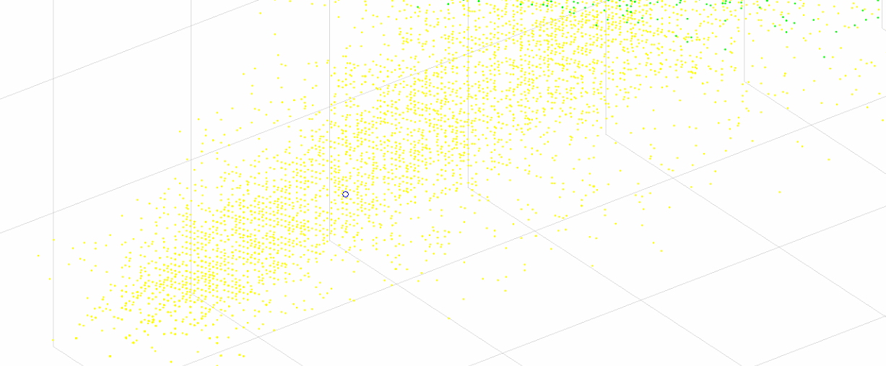
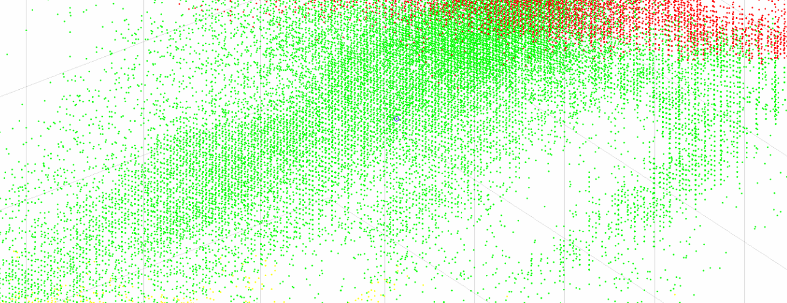

# Skin-Color-Detection
A simple Matlab implementation of paper: S.L. Phung, A. Bouzerdoum
, D. Chai, "A novel skin color model in YCbCr color space and its application to human face detection", ICIP 2002.

# Required:
1. Dataset: <br>
lfw images: http://vis-www.cs.umass.edu/lfw/lfw-funneled.tgz <br>
※trainset need to remove the background and non-skin area <br>
labeled parts: http://vis-www.cs.umass.edu/lfw/part_labels/parts_lfw_funneled_gt_images.tgz

# Execution
## Training
modify the file path if necessary, this example only takes two image for training
```
Run skin_training.m
```
Output the skin distribution in YCbCr
<br>

<br>
The first group Y1 center

<br>
The second group Y2 center

<br>
The thirf group Y3 center

<br>
modify the file path if necessary, this example only takes one image for testing
## Testing
```
Run skin_testing.m
```
