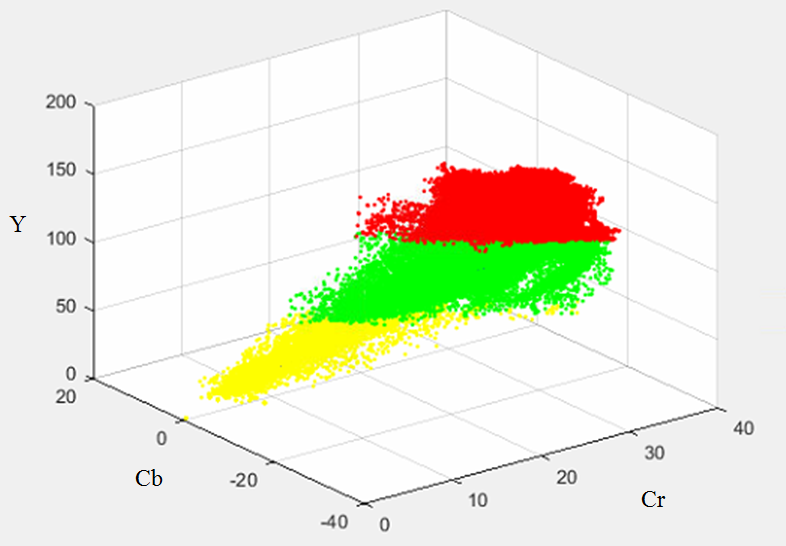

# Skin-Color-Model
A simple Matlab implementation of paper: S.L. Phung, A. Bouzerdoum
, D. Chai, "A novel skin color model in YCbCr color space and its application to human face detection", ICIP 2002.

# Required:
1. Dataset: <br>
lfw images: http://vis-www.cs.umass.edu/lfw/lfw-funneled.tgz <br>
labeled parts: http://vis-www.cs.umass.edu/lfw/part_labels/parts_lfw_funneled_gt_images.tgz
1. train_set: <br>
Remove the background and non-skin part(train_set.7z)

# Execution
## Training
modify the file path if necessary, this example only takes one image for training
modify the number of iteration if necessary.
```
Run skin_training.m
```
Output the skin distribution in YCbCr
<br>

<br>

## Testing
```
Run skin_testing.m
```
